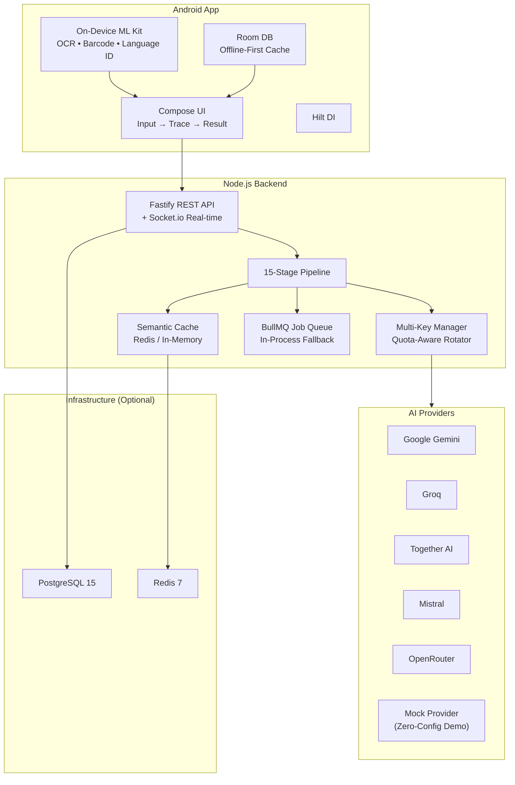

<div align="center">

#  Neural Forge

### AI Workload Planner & Orchestrator

**One prompt in → intelligent task graph out → right model for every subtask → verified result back.**

[](https://nodejs.org/)
[](https://www.typescriptlang.org/)
[](https://kotlinlang.org/)
[](#-test-suite)
[](#license)

<br/>

[**Quick Start**](#-quick-start) · [**Architecture**](#-architecture) · [**API Reference**](#-api-reference) · [**Demo**](#-see-it-in-action) · [**Contributing**](#-contributing)

---

*Built for the **iQOO AI Hackathon**

</div>

<br/>

##  The Problem

Every AI app today does this: take a prompt → pick a model → send the whole thing → hope for the best.

**That's a router. Not intelligence.**

When you paste a 42 KB Java file and say *"find the bugs"*, a router shoves all 12,800 tokens into one model and prays. You pay for tokens you didn't need, wait for a single model's opinion, and get zero visibility into what happened.

##  The Solution

**Neural Forge doesn't route — it *thinks*.**

It takes your request, understands the intent, decomposes it into a **dependency graph of subtasks**, gives each subtask **only the context slice it needs**, routes each one to the **model best suited by capability**, runs independent subtasks **in parallel**, recovers from failures **without killing the plan**, then merges, verifies, and reports **what it actually spent**.

<div align="center">

```
 42 KB Java file + "find the bugs"
                    ↓
       ┌────────────────────────┐
       │  Classify → Enhance →  │
       │  Decompose → 5-node    │
       │  DAG with dependencies │
       └────────────────────────┘
                    ↓
    ┌───────────────┼───────────────┐
    ↓               ↓               ↓
 Subtask A       Subtask B       Subtask C      ← 3 models, parallel
 ~1.8K tokens    ~2.1K tokens    ~2.8K tokens   ← context-sliced
 (code style)    (logic bugs)    (security)     ← capability-matched
    ↓               ↓               ↓
    └───────────────┼───────────────┘
                    ↓
       ┌────────────────────────┐
       │  Aggregate → Verify →  │
       │  Calibrate → Report    │
       └────────────────────────┘
                    ↓
           Verified result + honest telemetry
           6.7K tokens used vs 12.8K naive
           47.6% context reduction (measured, not estimated)
```

</div>

##  Key Features

<table>
<tr>
<td width="50%">

###  Intelligent Decomposition
Requests become a **DAG of subtasks** with explicit dependencies and parallel batches — not a flat list of API calls.

###  Context Slicing
Each subtask receives **only the context it needs**. A 12.8K token input becomes four 1.8K slices. Savings are measured and surfaced, never estimated.

###  Parallel Execution
Independent subtasks run **concurrently** across different models. A 5-node graph with 3 independent nodes = 3 models working simultaneously.

</td>
<td width="50%">

###  Self-Healing Recovery
Provider fails? Neural Forge **retries → rotates keys → swaps models → re-plans** — the user never sees a crash.

###  Honest Telemetry
Savings are computed **only over subtasks that produced results**. Partial failures are reported. Nothing is hidden or inflated.

###  Prompt Security
User intent stays in the **directive channel**. OCR text, PDFs, and file contents travel as **escaped material** — injection attacks are neutralized server-side.

</td>
</tr>
</table>

##  Architecture

### The 15-Stage Pipeline

Every request flows through a principled pipeline where each stage emits trace events for real-time observability:

```
request
  ├─   safety            sanitize directive channel, neutralize untrusted content
  ├─   classify          rule table first; LLM only when rules are unsure
  ├─   enhance           split intent from material, restate goal/constraints
  ├─   optimize          compress master context, code blocks preserved verbatim
  ├─   decompose         → DAG of subtasks with explicit dependencies
  ├─   profile           per-node token + latency estimates, calibration-corrected
  ├─   slice             per-node context: only the sections that node needs
  ├─   plan              3 candidate plans (draft / balanced / premium), costed
  ├─   schedule          Kahn topological sort → parallel execution groups
  ├─   route             capability match → ranked models → first available key
  ├─   execute           provider call, cache check, confidence inference
  ├─   recover           retry / rotate key / swap model / skip / re-plan
  ├─   aggregate         collect, dedupe, detect contradictions, synthesize
  ├─   verify            critic + structural consistency, gated on confidence
  └─   telemetry         actuals vs estimates → EWMA calibration multipliers
```

### System Architecture



### Two Deployables

| Component | Stack | Purpose |
|-----------|-------|---------|
| **Backend** (`apps/api`) | Node 20 · Fastify · Socket.io · Prisma · BullMQ | Owns the 15-stage pipeline, multi-provider orchestration, and telemetry |
| **Android App** (`apps/android`) | Kotlin · Jetpack Compose · Hilt · Room · ML Kit | Multimodal front door — camera, PDF, audio, share-sheet with on-device preprocessing |

## 🎬 See It In Action

### Zero to Demo in 60 Seconds

```bash
# No API keys needed. No Docker needed. No database needed.
# The mock provider runs the full 15-stage pipeline offline.

git clone https://github.com/your-org/Model_Mesh.git
cd Model_Mesh
./scripts/setup.sh
pnpm --filter @modelmesh/api dev

# → http://localhost:3000 is live
```

### Submit Your First Task

```bash
curl -X POST http://localhost:3000/api/v1/tasks \
  -H "Content-Type: application/json" \
  -H "X-API-Key: dev-secret-change-me" \
  -d '{
    "instruction": "Review this code for bugs and security issues",
    "files": [{
      "name": "app.java",
      "mimeType": "text/x-java",
      "content": "public class App { public static void main(String[] args) { ... } }"
    }],
    "strategy": "balanced"
  }'
```

**Response** — the pipeline is already running:
```json
{
  "taskId": "tsk_abc123",
  "status": "processing",
  "websocketRoom": "task:tsk_abc123",
  "estimatedMs": 12000,
  "executionMode": "parallel"
}
```

### Watch It Think (Real-Time)

Connect via Socket.io to see every pipeline stage as it happens:

```javascript
import { io } from "socket.io-client";

const socket = io("http://localhost:3000", {
  path: "/ws",
  auth: { apiKey: "dev-secret-change-me" }
});

socket.emit("subscribe", { taskId: "tsk_abc123" });

socket.on("trace", (event) => {
  console.log(`[${event.stage}] ${event.message}`);
  // [classify]  → code_review, complexity: high
  // [decompose] → 5 subtasks, 3 parallel groups
  // [execute]   → subtask-1 routed to gemini-1.5-flash
  // [execute]   → subtask-2 routed to groq/llama-3
  // [verify]    → confidence 0.91, verification passed
  // [telemetry] → 6,714 tokens used, 47.6% context reduction
});
```

##  Six Design Principles

> These aren't aspirational — they're enforced in code and validated in tests.

| # | Principle | Enforcement |
|---|-----------|-------------|
| **1** | **Never send full context to every model** | Per-subtask slicing. `contextReductionPercent` is measured and surfaced, never estimated optimistically. |
| **2** | **A DAG, not a list** | Decomposition produces explicit dependencies and parallel batches; the app draws the actual execution graph. |
| **3** | **Capability-based routing** | The app never names a model. It may express a budget and a "prefer on-device" hint; the backend chooses. |
| **4** | **Every estimate gets calibrated** | Actuals feed EWMA multipliers per task type and role; user ratings feed the same loop. |
| **5** | **Confidence drives compute** | Confidence is inferred from output patterns, not self-reported, and it decides whether verification runs. |
| **6** | **User intent ≠ untrusted content** | Typed instruction is the only thing in the directive channel; OCR/PDF/file contents are delimiter-escaped. Enforced on both client and server. |

##  Android App — On-Device Intelligence

The Android app isn't just a chat UI — it's a **multimodal preprocessing engine**:

| Input | On Device | On The Wire |
|-------|-----------|-------------|
|  **Image** | ML Kit OCR + barcode + dimensions | Base64 (for vision models) + extracted text |
|  **PDF** | `PdfRenderer` → bitmap → OCR per page (≤20 pages) | **Text only** — a 4 MB scan travels as a few KB |
|  **Text file** | Read as UTF-8 | Text only |
|  **Audio/Video** | Duration via `MediaMetadataRetriever` | Metadata only |

**Offline-first by design:** Every `observe*` flow reads from Room. Network writes to Room. Room re-emits. The screen renders with the radio off and updates when the backend answers.

##  Test Suite

**192 tests across 11 files — all passing.**

```bash
pnpm --filter @modelmesh/api test         # Run all tests
pnpm --filter @modelmesh/api typecheck    # Type safety
pnpm --filter @modelmesh/api build        # Production build
```

| Test File | What It Validates |
|-----------|-------------------|
| `dag.test.ts` | Cycle detection, parallel groups, dependency validation |
| `scheduler.test.ts` | Group execution, degraded dependencies, re-planning |
| `optimizer.test.ts` | Token passes, fenced-code preservation, context slicing |
| `profiler.test.ts` | Estimates and naive baseline comparison |
| `calibration.test.ts` | EWMA multipliers and clamping |
| `keys.test.ts` | Health scoring, 429 rotation, quota exhaustion |
| `classifier.test.ts` | Rule table, modality evidence, complexity |
| `safety.test.ts` | Injection scoring, directive channel neutralization |
| `mock-provider.test.ts` | Determinism, role-shaped JSON, failure injection |
| `tasks.test.ts` | End-to-end `POST /tasks`, strategy differences, hostile documents |
| `telemetry-honesty.test.ts` | Savings counted only for subtasks that actually ran |

##  API Reference

**Base:** `/api/v1` · **Auth:** `X-API-Key` header on every call

### Core Endpoints

| Method | Endpoint | Description |
|--------|----------|-------------|
| `POST` | `/tasks` | Submit a task → `202` with taskId, websocket room, estimates |
| `GET` | `/tasks/:taskId` | Full snapshot: result, plan, subtasks, verification, telemetry |
| `GET` | `/tasks/:taskId/trace` | Execution trace events (polling fallback) |
| `GET` | `/tasks/:taskId/events` | SSE mirror of the websocket stream |
| `GET` | `/tasks?limit=` | List tasks (1–100, default 20) |
| `POST` | `/tasks/:taskId/feedback` | Submit rating (1–5) → feeds calibration loop |

### Provider Management

| Method | Endpoint | Description |
|--------|----------|-------------|
| `GET` | `/providers/status` | Provider health and availability |
| `GET` | `/providers/models` | Available models and capabilities |
| `GET` | `/providers/keys` | Registered keys (masked) |
| `POST` | `/providers/keys` | Register a new API key (deduplicated by hash) |

### Observability

| Method | Endpoint | Description |
|--------|----------|-------------|
| `GET` | `/telemetry/stats?days=` | Usage statistics over time |
| `GET` | `/telemetry/calibration` | Current calibration multipliers |
| `GET` | `/health` | Health check (unauthenticated) |
| `GET` | `/ready` | Readiness probe (unauthenticated) |

### Socket.io Real-Time

```
Path: /ws
Auth: { apiKey: "your-key" }
Events: subscribe → trace_history (replay) → trace (live stream)
Limit: 5 concurrent connections per key
Fallback: GET /tasks/:id/trace (polling)
```

##  Quick Start

### Prerequisites

| Component | Requirement |
|-----------|-------------|
| **Backend** | Node ≥ 20, pnpm ≥ 11 |
| **Infrastructure** | Docker (optional — for Postgres + Redis) |
| **Android** | JDK 17, Android SDK 35, Android Studio Ladybug+ |
| **AI Providers** | Nothing — mock provider runs the full pipeline offline |

### 1. Clone & Setup

```bash
git clone https://github.com/your-org/Model_Mesh.git
cd Model_Mesh
./scripts/setup.sh    # Checks tools, installs deps, generates Prisma, runs tests
```

### 2. Start the Backend

```bash
pnpm --filter @modelmesh/api dev    # → http://localhost:3000
```

### 3. (Optional) Add Real Infrastructure

```bash
docker compose up -d    # Postgres 15 + Redis 7
pnpm run seed           # Register provider keys from .env
```

### 4. (Optional) Add AI Provider Keys

```bash
cp .env.example .env
# Edit .env and add your API keys:
# GEMINI_API_KEYS="key1,key2"
# GROQ_API_KEYS="key1"
```

### 5. (Optional) Build Android

```bash
cd apps/android
gradle wrapper --gradle-version 8.11.1
./gradlew :app:assembleDebug
```

> **Note:** The Android app requires the UI track's `res/` and `MainActivity.kt` to compile. The data layer, preprocessing, and DI graph are complete.

##  Project Structure

```
Model_Mesh/
├── apps/
│   ├── api/                         Node 20 + Fastify + Socket.io backend
│   │   ├── src/
│   │   │   ├── core/
│   │   │   │   ├── intelligence/    classifier, decomposer, enhancer, profiler
│   │   │   │   ├── orchestrator/    DAG, executor, planner, recovery, scheduler
│   │   │   │   ├── optimizer/        context compression & slicing
│   │   │   │   ├── providers/       gemini, groq, together, mistral, openrouter, mock
│   │   │   │   ├── aggregator/      result synthesis & contradiction detection
│   │   │   │   ├── verifier/        confidence-gated verification
│   │   │   │   ├── cache/           semantic caching layer
│   │   │   │   ├── telemetry/       calibration & honest reporting
│   │   │   │   └── pipeline.ts      15-stage orchestration entry point
│   │   │   ├── keys/                multi-key manager + quota-aware rotator
│   │   │   ├── api/                 routes + auth/rate-limit/safety middleware
│   │   │   ├── infra/                store, persistence, crypto, text, logger
│   │   │   └── jobs/                 BullMQ queue + worker (in-process fallback)
│   │   ├── prisma/schema.prisma
│   │   └── tests/                   11 files, 192 tests
│   └── android/                     Kotlin + Compose (JVM 17, minSdk 26)
│       └── app/src/
│           ├── domain/             use cases + ports
│           ├── data/               API client, Room DB, ML Kit preprocessing
│           └── di/                 Hilt modules
├── packages/types/                  shared TypeScript contract
├── scripts/                          setup.sh, seed-keys.ts, test-providers.ts
├── docker-compose.yml               Postgres 15 + Redis 7 (both optional)
└── turbo.json                       Turborepo monorepo config
```

##  Configuration

All variables have working defaults. Zero configuration needed for demo mode.

<details>
<summary><b> Full Environment Variable Reference</b></summary>

| Variable | Default | Description |
|----------|---------|-------------|
| `PORT` / `HOST` | `3000` / `0.0.0.0` | HTTP listener |
| `NODE_ENV` | `development` | Environment |
| `API_SECRET` | `dev-secret-change-me` | API key for all REST and socket auth |
| `KEY_ENCRYPTION_SECRET` | dev value | AES-256-GCM key-at-rest encryption |
| `DATABASE_URL` | — | Postgres connection (optional) |
| `REDIS_URL` | — | Redis connection (optional) |
| `PERSISTENCE` | `auto` | `auto` · `prisma` · `memory` |
| `CACHE_BACKEND` | `auto` | `auto` · `redis` · `memory` |
| `GEMINI_API_KEYS` | — | Comma-separated API keys |
| `GROQ_API_KEYS` | — | Comma-separated API keys |
| `TOGETHER_API_KEYS` | — | Comma-separated API keys |
| `MISTRAL_API_KEYS` | — | Comma-separated API keys |
| `OPENROUTER_API_KEYS` | — | Comma-separated API keys |
| `ENABLE_MOCK_PROVIDER` | `true` | Auto-enables when no real keys exist |
| `ENABLE_SEMANTIC_CACHE` | `true` | Semantic result caching |
| `ENABLE_PARALLEL_EXECUTION` | `true` | Parallel subtask execution |
| `ENABLE_VERIFICATION` | `true` | Confidence-gated verification |
| `MAX_PARALLEL_SUBTASKS` | `4` | Width of a parallel batch |
| `DEFAULT_STRATEGY` | `balanced` | `draft` · `balanced` · `premium` |
| `TASK_TIMEOUT_MS` | `60000` | Total task timeout |
| `PROVIDER_TIMEOUT_MS` | `45000` | Per-provider call timeout |
| `MAX_FILE_BYTES` | `20971520` | Max file size (20 MB) |
| `MAX_ATTEMPTS_PER_SUBTASK` | `3` | Retry limit per subtask |

</details>

##  Contributing

This is a monorepo managed with [Turborepo](https://turbo.build/) and [pnpm workspaces](https://pnpm.io/workspaces).

```bash
pnpm install              # Install all dependencies
pnpm run dev              # Start all apps in dev mode
pnpm run build            # Build everything
pnpm run test             # Run all tests
pnpm run typecheck        # Type-check everything
```

##  Why This Wins

<table>
<tr>
<td width="33%" align="center">
<b>Not a wrapper</b><br/>
A 15-stage pipeline with DAG decomposition, context slicing, and capability routing. This is AI infrastructure, not another API proxy.
</td>
<td width="33%" align="center">
<b>Full stack</b><br/>
Backend + Android app with on-device ML preprocessing. A 4 MB PDF scan travels as a few KB of text.
</td>
<td width="33%" align="center">

<b>Actually tested</b><br/>
192 passing tests. Types checked. Builds clean. Honest telemetry — partial failures are never hidden.
</td>
</tr>
</table>

---

<div align="center">

**Built with  for the iQOO AI Hackathon**

*Neural Forge — because intelligence should sit in the orchestrator, not the prompt.*

</div>
